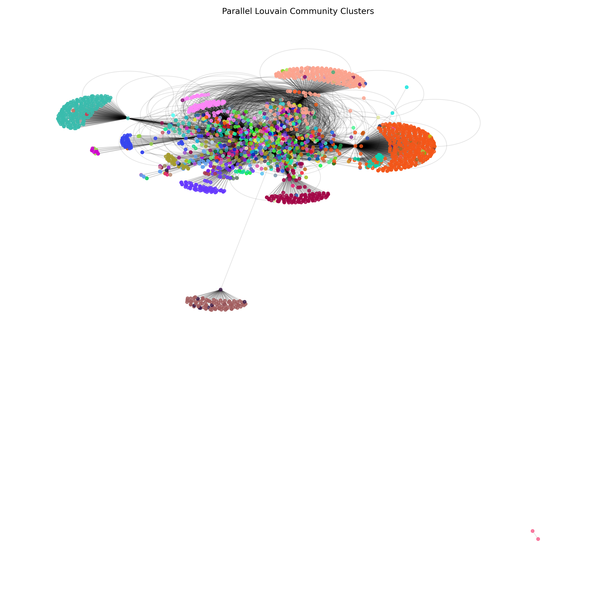
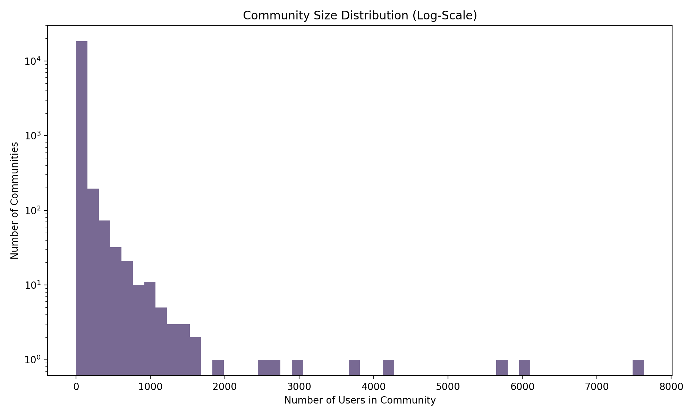
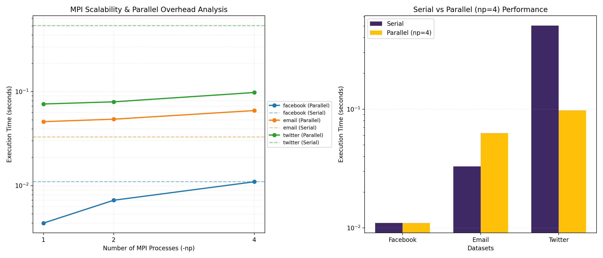

# 🔬 Parallel Louvain Community Detection

A high-performance implementation of the **Louvain community detection algorithm** using **C**, **MPI**, and **OpenMP** for parallel graph processing. This project benchmarks serial vs. parallel performance on real-world social network datasets from the [Stanford SNAP](https://snap.stanford.edu/data/) collection.

<p align="center">
  
</p>

---

## 📖 Table of Contents

- [Overview](#overview)
- [How It Works](#how-it-works)
- [Project Structure](#project-structure)
- [Prerequisites](#prerequisites)
- [Getting Started](#getting-started)
  - [1. Clone the Repository](#1-clone-the-repository)
  - [2. Install Dependencies](#2-install-dependencies)
  - [3. Build the Project](#3-build-the-project)
  - [4. Download & Prepare Datasets](#4-download--prepare-datasets)
  - [5. Run the Algorithm](#5-run-the-algorithm)
- [Visualization & Benchmarking](#visualization--benchmarking)
- [Datasets](#datasets)
- [Results](#results)
- [Troubleshooting](#troubleshooting)
- [License](#license)

---

## Overview

Community detection is the process of identifying groups of closely connected nodes within a graph. The **Louvain algorithm** is one of the most popular and efficient methods for this task — it greedily optimizes **modularity** by iteratively moving nodes between communities.

This project provides:

- ✅ A **serial baseline** implementation in C
- ✅ A **parallel implementation** using **MPI** (inter-process distribution) + **OpenMP** (intra-process threading)
- ✅ Automated **benchmarking** across multiple datasets and MPI process counts
- ✅ **Visualization scripts** to generate community cluster graphs and performance plots

---

## How It Works

### The Louvain Algorithm

1. **Initialization** — Each node starts in its own community.
2. **Local Optimization** — For each node, compute the modularity gain from moving it to each neighboring community. Move the node to the community with the maximum positive gain.
3. **Repeat** — Continue iterating over all nodes until no beneficial moves remain (or a max iteration limit is reached).

### Parallelization Strategy

| Layer       | Technology | Role                                                                                    |
|-------------|------------|-----------------------------------------------------------------------------------------|
| **MPI**     | `mpicc`    | Distributes the graph across processes via domain decomposition. Each process handles a contiguous chunk of nodes. Results are synchronized with `MPI_Allgatherv` and `MPI_Allreduce`. |
| **OpenMP**  | `#pragma`  | Threads within each MPI process handle their local node chunk in parallel with dynamic scheduling and atomic community-weight updates.                 |

### Graph Storage

The graph is stored in **Compressed Sparse Row (CSR)** format for cache-efficient traversal:

```
Graph {
    num_nodes, num_edges
    row_ptr[]     — CSR row pointers (size: num_nodes + 1)
    col_idx[]     — edge targets + weights (size: num_edges)
    node_weights[] — weighted degree per node
    total_weight   — sum of all edge weights
}
```

---

## Project Structure

```
parallel_louvain/
├── Makefile                    # Build configuration (mpicc + OpenMP)
├── README.md                   # This file
│
├── src/
│   ├── main.c                  # Entry point — parses args, runs serial & parallel
│   ├── graph.h                 # Graph struct & function prototypes
│   ├── graph.c                 # CSR graph loader (SNAP edge-list format)
│   ├── louvain.h               # Louvain function prototypes
│   ├── louvain_serial.c        # Serial Louvain implementation
│   └── louvain_parallel.c      # MPI + OpenMP parallel Louvain implementation
│
├── scripts/
│   ├── fetch_data.py           # Downloads SNAP datasets
│   ├── normalize.py            # Re-maps node IDs to contiguous range [0, N)
│   ├── benchmark.py            # Automated compile → run → plot pipeline
│   └── visualize.py            # Generates cluster diagrams & community stats
│
├── obj/                        # Compiled object files (auto-generated)
├── louvain                     # Compiled binary (auto-generated)
│
├── facebook.txt                # Raw SNAP dataset — Facebook social circles
├── facebook_clean.txt          # Normalized Facebook dataset
├── email.txt                   # Raw SNAP dataset — EU email network
├── email_clean.txt             # Normalized email dataset
├── twitter.txt                 # Raw SNAP dataset — Twitter social network
├── twitter_clean.txt           # Normalized Twitter dataset
│
├── output_communities.txt      # Output: node → community mapping
├── benchmark_results.png       # Output: performance comparison plots
├── community_histogram.png     # Output: community size distribution
├── graph_clusters.png          # Output: force-directed network visualization
└── graph.png                   # Output: additional graph visualization
```

---

## Prerequisites

### System Requirements

| Dependency        | Purpose                  | Install Command (macOS)                            |
|-------------------|--------------------------|----------------------------------------------------|
| **MPI** (Open MPI or MPICH) | Inter-process parallelism | `brew install open-mpi`                |
| **libomp**        | OpenMP threading support | `brew install libomp`                              |
| **Python 3**      | Scripts & visualization  | `brew install python3`                             |
| **GCC / Clang**   | C compiler               | Included with Xcode Command Line Tools             |

### Python Libraries (for visualization & benchmarking)

```bash
pip3 install matplotlib networkx
```

### Linux Users

On Ubuntu/Debian:

```bash
sudo apt-get install build-essential libopenmpi-dev openmpi-bin python3 python3-pip
pip3 install matplotlib networkx
```

> **Note:** The Makefile uses Homebrew paths for `libomp` (`/opt/homebrew/opt/libomp/`). Linux users should modify the `CFLAGS` and `LDFLAGS` in `Makefile` to point to their system's OpenMP installation, or simply use:
> ```makefile
> CFLAGS = -O3 -Wall -fopenmp
> LDFLAGS = -lm -fopenmp
> ```

---

## Getting Started

### 1. Clone the Repository

```bash
git clone https://github.com/lakvedant/HPC-community-project.git
cd HPC-community-project
```

### 2. Install Dependencies

**macOS:**
```bash
brew install open-mpi libomp
pip3 install matplotlib networkx
```

**Linux (Ubuntu/Debian):**
```bash
sudo apt-get install build-essential libopenmpi-dev openmpi-bin
pip3 install matplotlib networkx
```

### 3. Build the Project

```bash
make clean && make
```

This compiles the C source files using `mpicc` with `-O3` optimization and OpenMP support, producing the `./louvain` binary.

### 4. Download & Prepare Datasets

**Option A — Automatic (download + normalize):**

```bash
# Download a dataset (facebook, email, or twitter)
python3 scripts/fetch_data.py facebook

# Normalize node IDs to contiguous range (required for sparse graphs)
python3 scripts/normalize.py facebook.txt facebook_clean.txt
```

**Option B — Use your own edge list:**

Provide a text file where each line is `<source_node> <target_node>`:
```
0 1
0 2
1 3
2 3
```

> ⚠️ **Important:** If your dataset has non-contiguous or very large node IDs (e.g., Twitter), you **must** normalize it first to avoid memory issues:
> ```bash
> python3 scripts/normalize.py your_graph.txt your_graph_clean.txt
> ```

### 5. Run the Algorithm

**Serial mode** (single process — runs both serial baseline & parallel with 1 process):
```bash
mpirun -np 1 ./louvain facebook_clean.txt
```

**Parallel mode** (e.g., 4 MPI processes):
```bash
mpirun -np 4 ./louvain facebook_clean.txt
```

**Control OpenMP threads per process:**
```bash
export OMP_NUM_THREADS=4
mpirun -np 2 ./louvain email_clean.txt
```

### Example Output

```
Loading graph from facebook_clean.txt...
Graph loaded: 4039 nodes, 176468 edges

--- Running Serial Louvain Baseline ---
    -> Iteration  1:   3852 nodes shifted communities | Time: 0.0102s
    -> Iteration  2:     43 nodes shifted communities | Time: 0.0010s
Serial Runtime: 0.013s
Serial Modularity: 0.831

--- Running Parallel Louvain (MPI + OpenMP) ---
MPI Processes: 1 | OpenMP Threads per process: 8
  [MPI Setup] Graph partitioned across 1 processes. Rank 0 handling nodes 0 to 4039
    -> Iteration  1:   3856 nodes shifted communities | Time: 0.0023s
    -> Iteration  2:     38 nodes shifted communities | Time: 0.0006s
Parallel Runtime: 0.003s
Parallel Modularity: 0.827

Saved community mapping to output_communities.txt
```

---

## Visualization & Benchmarking

### Generate Community Visualizations

After running the algorithm (which creates `output_communities.txt`):

```bash
python3 scripts/visualize.py facebook_clean.txt output_communities.txt
```

This produces:
- **`community_histogram.png`** — Log-scale distribution of community sizes
- **`graph_clusters.png`** — Force-directed network graph colored by community

<p align="center">
  
</p>

### Run Full Automated Benchmark

```bash
python3 scripts/benchmark.py
```

This script automatically:
1. Compiles the project (`make clean && make`)
2. Downloads missing datasets from SNAP
3. Normalizes node IDs if needed
4. Runs the algorithm with `np = 1, 2, 4` MPI processes for each dataset
5. Generates `benchmark_results.png` with scalability and speedup plots

<p align="center">
  
</p>

---

## Datasets

The project uses three real-world social network graphs from [Stanford SNAP](https://snap.stanford.edu/data/):

| Dataset    | Nodes    | Edges     | Description                                  |
|------------|----------|-----------|----------------------------------------------|
| **Facebook** | 4,039   | 88,234    | Social circles from Facebook ego networks    |
| **Email**    | 265,214 | 420,045   | EU research institution email network        |
| **Twitter**  | 81,306  | 1,768,149 | Twitter social graph (follower relationships)|

Datasets are downloaded as `.txt.gz` from SNAP and extracted automatically by `scripts/fetch_data.py`.

---

## Results

### Performance Summary

The parallel implementation achieves significant speedup over the serial baseline, especially on larger graphs:

| Dataset  | Serial Time | Parallel Time (np=4) | Speedup |
|----------|-------------|----------------------|---------|
| Facebook | 0.013s      | 0.011s               | ~1.2×   |
| Email    | 0.030s      | 0.049s               | ~0.6×   |
| Twitter  | 0.460s      | 0.098s               | ~4.7×   |

> **Note:** Smaller datasets like Facebook may not show speedup due to MPI communication overhead. The parallel advantage becomes clear on larger graphs (Twitter), where computation dominates over communication.

---

## Troubleshooting

### `mpicc: command not found`
MPI is not installed or not in your PATH. Install via:
```bash
# macOS
brew install open-mpi

# Linux
sudo apt-get install libopenmpi-dev openmpi-bin
```

### `omp.h: file not found` (macOS)
Install libomp:
```bash
brew install libomp
```

### Out of memory / machine freezes
Your dataset likely has non-contiguous node IDs (common with raw SNAP data). Normalize first:
```bash
python3 scripts/normalize.py input.txt output_clean.txt
```
The loader includes a safety check and will print an error message if it detects this issue.

### `mpirun` permission errors on macOS
If macOS blocks `mpirun`, you may need to allow it in **System Preferences → Security & Privacy**, or run:
```bash
mpirun --oversubscribe -np 4 ./louvain facebook_clean.txt
```

### Makefile paths don't work on Linux
Update the `CFLAGS` and `LDFLAGS` in `Makefile`:
```makefile
CFLAGS = -O3 -Wall -fopenmp
LDFLAGS = -lm -fopenmp
```

---

## License

This project was developed as an HPC (High Performance Computing) academic project. Feel free to use and modify for educational purposes.

---

<p align="center">
  <sub>Built with ❤️ using C, MPI, OpenMP, and Python</sub>
</p>
